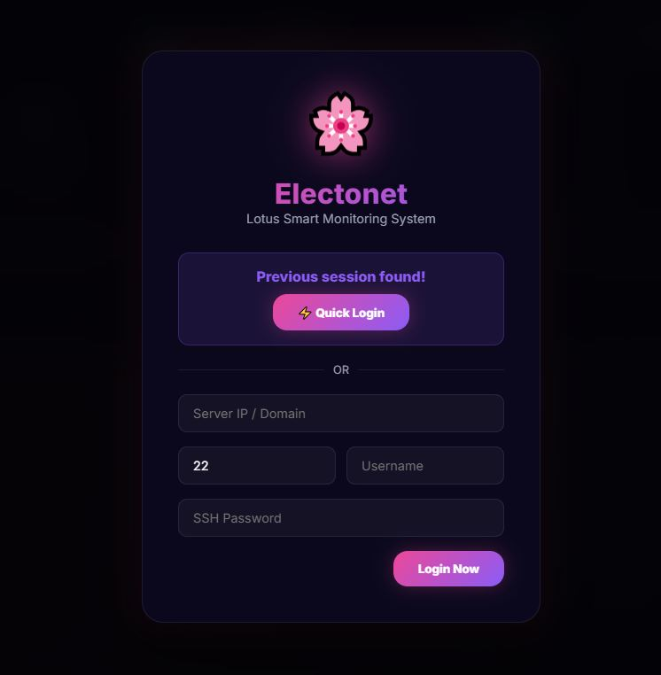
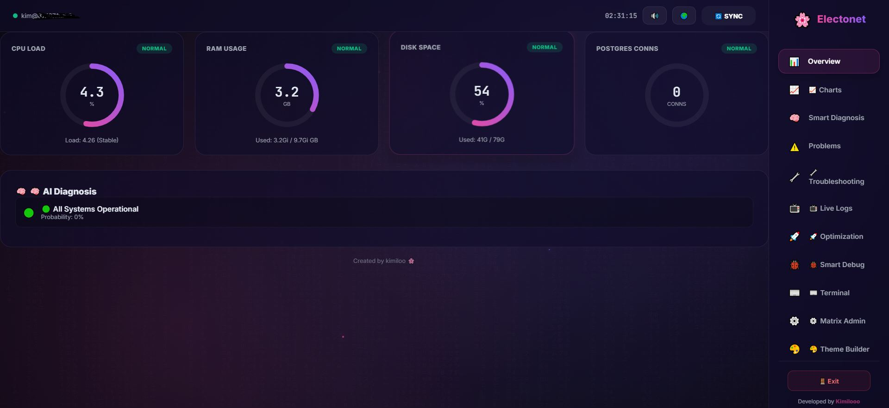
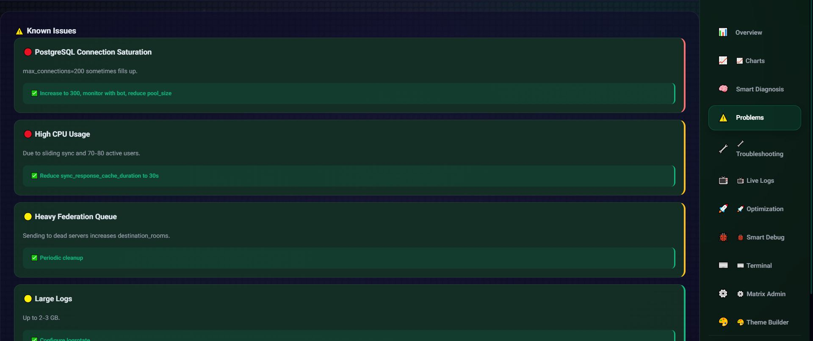
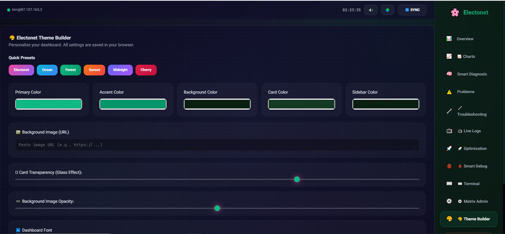
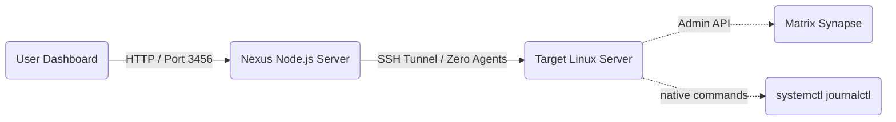

# 🌸 Electonet (v3.5+ REVAMP)
*Modern, Lightweight, Zero-Agent Server Monitoring*

 
 


---

## 📸 Screenshots | تصاویر

<div align="center">
  
  
  
  
</div>

| Screenshot | Description | توضیحات |
|---|---|---|
| Login Page | Quick login with saved sessions | ورود سریع با ذخیره نشست |
| Dashboard | Real-time CPU/RAM/Disk/PostgreSQL | مانیتورینگ لحظه‌ای منابع |
| Problems | Known issues & auto-fix suggestions | مشکلات شناخته شده و راهکار |
| Theme Builder | Full UI customization | شخصی‌سازی کامل رابط کاربری |

---

## 🇺🇸 English Documentation

**Electonet** is a "God-Tier" server monitoring and management system designed for maximum performance and visual aesthetics. Built with a futuristic glassmorphism UI, it provides real-time insights into your Linux infrastructure without requiring any software installation on the target servers.

### ✨ What makes it special?
- **Zero-Agent Architecture:** Connects securely via SSH and parses native Linux commands. No Prometheus, no Zabbix, no bloat.
- **Advanced Theme Builder:** Real-time customization of primary colors, menu backgrounds, card transparency, and custom background images.
- **Matrix Synapse Command Center:** Dedicated management for Synapse admins—purge media, manage users, and fetch API stats over a secure SSH proxy.
- **Smart Diagnosis:** Interprets raw server data into human-readable health reports.
- **Bilingual Interface:** Built-in support for English (LTR) and Persian (RTL) with automatic font switching and direction management.

### 🕸️ Architecture Flow


### 🚀 Getting Started
1. **Clone the repository:**
   ```bash
   git clone https://github.com/kimilooo/electonet.git
   cd electonet
   ```
2. **Install dependencies:**
   ```bash
   npm install
   ```
3. **Configure environment (optional):**
   ```bash
   cp .env.example .env
   # Edit .env with your custom settings, or skip this step to use defaults
   ```
4. **Run the server:**
   ```bash
   node server.js
   ```
5. **Access UI:** Open `http://localhost:3456` and connect using your server's SSH credentials.

### 🐛 Found a Bug? | Feature Request?
Your support means everything 🫶 If you encounter any issues or have a brilliant idea:
1. Open an **Issue** on GitHub: [Create Issue](https://github.com/kimilooo/electonet/issues/new)
2. Tag it properly: `bug`, `enhancement`, or `question`
3. Describe the problem or idea with as much detail as possible

Every contribution, big or small, makes Electonet better for everyone.

### 🌊 Contribution (GitHub Flow)
We follow the **GitHub Flow**:
1. **Fork** the project
2. Create your Feature Branch (`git checkout -b feature/AmazingFeature`)
3. Commit your changes (`git commit -m 'Add some AmazingFeature'`)
4. Push to the Branch (`git push origin feature/AmazingFeature`)
5. Open a **Pull Request**

---

## 🇮🇷 راهنمای فارسی (Persian Documentation)

**الکتونت (Electonet)** یک سیستم مانیتورینگ و مدیریت سرور حرفه‌ای است که با تمرکز بر زیبایی بصری و پرفورمنس حداکثری طراحی شده است. این سیستم با رابط کاربری مدرن (Glassmorphism)، وضعیت زنده زیرساخت‌های لینوکسی شما را بدون نیاز به نصب هیچ‌گونه نرم‌افزار اضافی روی سرور مقصد نمایش می‌دهد.

### ✨ چرا الکتونت؟
- **بدون نیاز به ایجنت (Zero-Agent):** اتصال کاملاً امن از طریق SSH و پارس کردن دستورات بومی لینوکس. بدون نیاز به نصب ابزارهای سنگین مانیتورینگ.
- **تم‌ساز پیشرفته:** شخصی‌سازی آنی رنگ‌های اصلی، پس‌زمینه منو، میزان شفافیت شیشه‌ای و امکان قرار دادن تصویر پس‌زمینه دلخواه.
- **مرکز مدیریت ماتریکس:** ابزارهای اختصاصی برای ادمین‌های Matrix Synapse—پاکسازی مدیا، مدیریت کاربران و دریافت آمار API از طریق پروکسی امن SSH.
- **تشخیص هوشمند:** تبدیل داده‌های خام سرور به گزارش‌های سلامت قابل درک برای انسان.
- **رابط کاربری دوزبانه:** پشتیبانی داخلی از انگلیسی و فارسی با تغییر خودکار فونت و چیدمان بر اساس زبان انتخابی.

### 🚀 نصب و راه‌اندازی
1. **دریافت پروژه:**
   ```bash
   git clone https://github.com/kimilooo/electonet.git
   cd electonet
   ```
2. **نصب پیش‌نیازها:**
   ```bash
   npm install
   ```
3. **تنظیمات محیطی (اختیاری):**
   ```bash
   cp .env.example .env
   # فایل .env رو با تنظیمات دلخواه ویرایش کن، یا این قدم رو رد کن
   ```
4. **اجرای برنامه:**
   ```bash
   node server.js
   ```
5. **دسترسی:** آدرس `http://localhost:3456` را در مرورگر باز کرده و با مشخصات SSH سرور خود متصل شوید.

### 🐛 باگ پیدا کردی؟ | پیشنهاد ویژگی جدید؟
حمایت تو همه‌چیزه 🫶 اگه به مشکلی برخوردی یا ایده‌ای داری که الکترونت رو بهتر کنه:
1. یه **Issue** روی گیت‌هاب باز کن: [ساخت Issue جدید](https://github.com/kimilooo/electonet/issues/new)
2. برچسب مناسب رو بهش بزن: `bug` (باگ)، `enhancement` (پیشنهاد بهبود)، یا `question` (سوال)
3. مشکل یا ایده‌ات رو با جزئیات کامل توضیح بده

هر کمکی، کوچک یا بزرگ، الکترونت رو برای همه بهتر می‌کنه.

### 🌊 مشارکت و توسعه (GitHub Flow)
این پروژه از متدولوژی **GitHub Flow** پیروی می‌کند:
1. پروژه رو **Fork** کن
2. شاخه فیچرت رو بساز (`git checkout -b feature/AmazingFeature`)
3. تغییراتت رو کامیت کن (`git commit -m 'Add some AmazingFeature'`)
4. به شاخه‌ات پوش کن (`git push origin feature/AmazingFeature`)
5. یه **Pull Request** باز کن

---

## 📜 Open Source & License
This project is **Open Source** under the MIT License. 
**Important:** You are free to use, modify, and distribute this software, but you **MUST** keep the credit to the original author (**Kimilooo**) in the footer and documentation.

## 📸 Developed By
**Kimilooo** - [GitHub Profile](https://github.com/kimilooo)

> **Note:** This project is part of the **Electonet** ecosystem. For the best experience, adjust the glass transparency in the **Theme Builder** to match your chosen background.

